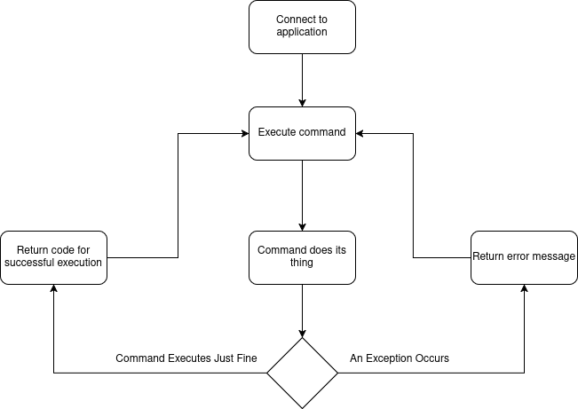
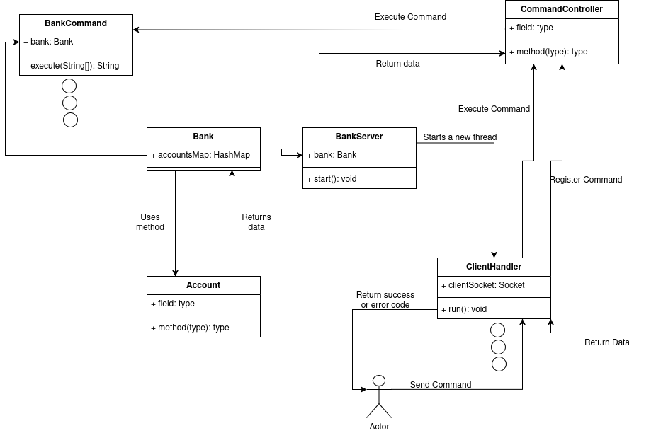

Documentation
===

Setup
---

First clone the repository from GitHub, or download the whole zip file.             
After that you will need to copy the config.properties file into the same directory as the jar file. The jar file 
is by default located inside the ./out/artifacts/PV_Networking_Application_jar directory.               
There are some example data inside, do not pay too much attention to them.              

| Variable | Description                                                                                                                       | Extra                                                                              |                  
|----------|-----------------------------------------------------------------------------------------------------------------------------------|------------------------------------------------------------------------------------|                  
| TIMEOUT  | Sets timeout for user inaction in seconds. The client socket will be closed after the specified time if no more commands are sent |                                                                                    |                  
| PORT     | The port on which the application will start on                                                                                   |                                                                                    |                
| IP       | The IPv4 address the application will start on                                                                                    | If left blank, the program will dynamically start your program on one of your NICs |                  

After setting your configuration variables, you can start the program with this command:

```shell
java -jar PV-Networking-Application.jar
```

Note that this project uses Java 21, so be sure to have a compatible version!               
To connect to the application, you can either use Ncat on Linux, or Putty on Windows. With Ncat, simply execute this
command:

```shell
nc <ip_address> <port>
```

With Putty, you need to set your connection type to raw. Then type the ip address of the server into the right field
and specify the port. You can then start the connection.

How to use
---

This application will start a server which will listen to incoming connections. You can use either Netcat or Putty
to connect to this application easily. Then you can execute one of the commands from the list lower by. The commands
are case-sensitive. In the column 'Call', you can see, what you need to write and send in order to execute the command.

| Name                   | Code | Call                                         | Answer When Successful        | Answer When Erroneous |
|------------------------|------|----------------------------------------------|-------------------------------|-----------------------|
| Bank Code              | BC   | BC                                           | BC &lt;ip&gt;                 | ER &lt;message&gt;    |
| Account Create         | AC   | AC                                           | AC &lt;account&gt;/&lt;ip&gt; | ER &lt;message&gt;    |
| Account Deposit        | AD   | AD &lt;account&gt;/&lt;ip&gt; &lt;number&gt; | AD                            | ER &lt;message&gt;    |
| Account Withdrawal     | AW   | AW &lt;account&gt;/&lt;ip&gt; &lt;number&gt; | AW                            | ER &lt;message&gt;    |
| Account Balance        | AB   | AB &lt;account&gt;/&lt;ip&gt;                | AB &lt;number&gt;             | ER &lt;message&gt;    |
| Account Remove         | AR   | AR &lt;account&gt;/&lt;ip&gt;                | AR                            | ER &lt;message&gt;    |
| Bank (Total) Amount    | BA   | BA                                           | BA &lt;number&gt;             | ER &lt;message&gt;    |
| Bank Number Of Clients | BN   | BN                                           | BN &lt;number&gt;             | ER &lt;message&gt;    |

The application logs everything everyone does into console and to a file, which will get created in the directory of the jar file.                  
If you want to end the user connection, type **END**.               
For commands AB, AD and AW, there is a special feature. If you specify a different bank id, the program will attempt to perform that action
at that particular bank. It will retrieve its answer or return an error, if the provided bank id did not respond. Note that this feature
assumes that the other bank application is running on the same port as yours. This is for the sake of the application being fast. Searching through a
range of ports would be unnecessarily long.

Operational Diagram
---



Program Architecture
---



Exceptions and Errors
---

The application deals with all errors and exception in similar manor. It returns a string with the error message to
the client, which caused the exception, then logs it.           
In the case of errors, which block the program from even starting, it logs them and returns an error message into the
console. The user then has to find a way to fix the error based on the message.

Third Party Libraries
---

org.apache.logging.log4j - log4j - version 2.23.0                       
com.google.guava - guava - version 32.1.0-jre               
junit - junit - version RELEASE

Resume
---

This project is supposed to be one node in a bigger peer-to-peer application. It simulates a bank and has some
predefined standardized commands, which the user can issue. It can also communicate with other bank applications in
a certain way.

Materials
---

Baeldung - A Guide To Java Sockets - https://www.baeldung.com/a-guide-to-java-sockets           
Medium (Dylan Smith) - Comprehensive Understanding of Shutdown Hook Mechanism - https://medium.com/javarevisited/java-concurrency-8-comprehensive-understanding-of-shutdown-hook-mechanism-2ce9906f30cb             
Baeldung - JVM Shutdown Hooks - https://www.baeldung.com/jvm-shutdown-hooks                 
DataSet Blog - Log4j2 - https://www.dataset.com/blog/maven-log4j2-project/          


